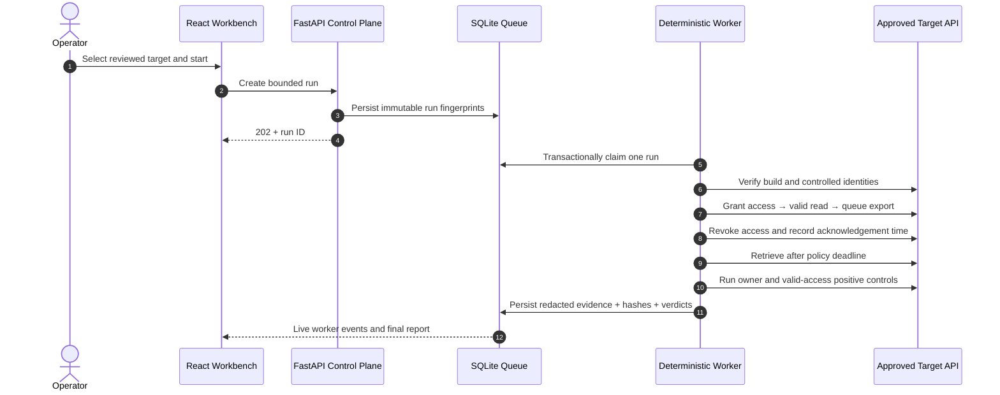

<div align="center">

# BoundaryLab

### Prove revoked access stays revoked.

**A policy-driven authorization regression workbench for APIs.**<br>
It maps permission boundaries, replays real multi-identity workflows, catches stale access after revocation, rejects fixes that break valid users, and turns the result into a CI-ready release decision.

[](https://github.com/ASHMITKATHAT/SentinelAPI-BoundaryLab/actions/workflows/boundarylab-ci.yml)


[Run the demo](#run-the-mentor-demo) · [See the proof](#working-proof) · [Architecture](#system-architecture) · [Judge walkthrough](#four-minute-judge-walkthrough) · [Business model](#business-model)

</div>

---

## The problem

A permission can disappear from the main screen while protected data remains reachable somewhere else.

Consider this sequence:

1. A temporary collaborator is allowed to read an invoice.
2. They queue an export while access is valid.
3. The owner revokes access; the invoice endpoint now correctly denies the collaborator.
4. The old export retrieval path still returns the protected invoice.

Every individual request can look reasonable in isolation. The failure exists **across identity, state and time**. Ordinary endpoint checks often miss it, and a hurried “owner-only” repair may stop the leak by breaking the product for every legitimate collaborator.

> **Access revoked is an instruction. Access actually gone is a behavior that must be proved.**

## What BoundaryLab does

BoundaryLab converts a reviewed business permission promise into repeatable evidence:

```text
Real API contract → reviewed access policy → bounded workflow replay
                  → redacted evidence → repair comparison → release gate
```

- **Discover:** import OpenAPI from GitHub or a local file and map ownership-sensitive operations without calling the target API.
- **Define:** state who may see which resource, in which lifecycle state, and how quickly revocation must take effect.
- **Verify:** run bounded HTTP requests with multiple controlled identities against an allowlisted lab or staging target.
- **Explain:** derive deterministic failure reasons and optional AI-assisted remediation from redacted failed-case facts.
- **Compare:** prove that a repair closes the leak while preserving valid owner and collaborator behavior.
- **Handoff:** export human-readable HTML and machine-readable JSON evidence for engineering, security and CI.

## Working proof

The repository ships three disclosed API implementations. The **same policy, identities and 12 cases** are used for each build; target names never decide verdicts.

| Implementation | Pass | Violations | Inconclusive | Release decision |
|---|---:|---:|---:|---|
| Vulnerable | 8 | 4 | 0 | **Blocked** |
| Over-restrictive owner-only repair | 7 | 2 | 3 | **Blocked** |
| Correct repair | 12 | 0 | 0 | **Pass in scope** |

The middle result is the point: BoundaryLab does not reward “deny everyone.” A secure repair must stop unauthorized access **and** preserve legitimate product behavior.

### What is real in the demo

- The worker sends actual HTTP requests to three independently running localhost APIs.
- The vulnerable run seals 26 sanitized request records and evaluates 12 policy cases.
- Verdicts use observed status, protected markers, field rules, identity controls and lifecycle state.
- Run events, evidence, comparisons and reports persist in SQLite and survive refresh/restart.
- GitHub import reads a real repository file and records repository, ref, path and file SHA.
- A missing identity, broken setup, timeout or insufficient proof becomes **inconclusive**, never a convenient pass.

Synthetic fixtures provide known ground truth for a repeatable competition demo. They are clearly labelled and are never presented as a customer breach.

## System architecture


The architecture separates passive analysis from active network execution. The React client can submit intent and read results, but only the deterministic worker can send target requests. The scoped transport is the sole outbound boundary.

| Layer | Responsibility | Key guarantee |
|---|---|---|
| React workbench | Six-stage operator journey and evidence review | Never receives target secrets |
| FastAPI control plane | Session, CSRF/origin checks, validation, reports and API contract | Fails closed when no trusted target is configured |
| Discovery engine | OpenAPI inventory, ownership candidates and optional HAR route diff | Passive; sends no target requests |
| Policy governance | Reviewed access expectations, deadlines and decision ledger | AI suggestions never auto-enter policy |
| SQLite WAL | Policies, queue, run events, reports and artifact references | Transactional single-worker claim and restart recovery |
| Deterministic worker | Compiles policy and executes supported scenarios | AI cannot schedule traffic or change verdicts |
| Scoped HTTP transport | Sends allowlisted operations to approved targets | Budgets, deadlines, one request in flight and no redirects |
| Evidence pipeline | Redacts, hashes, compares and exports results | Raw unrestricted bodies and credentials are not persisted |

Detailed invariants and trust boundaries are in [System Architecture](docs/08_SYSTEM_ARCHITECTURE.md) and [Security & Privacy](docs/15_SECURITY_PRIVACY.md).

## How one verification works



The final verdict can be **pass**, **violation** or **inconclusive**. Authentication failure, network failure and missing proof cannot masquerade as authorization success.

## Six product pages

| Page | Question it answers | What to show |
|---|---|---|
| **Start** | Why does this problem matter? | The four-moment breach story and live workspace proof |
| **Discover** | Where could protected data escape? | GitHub import, operation inventory, ownership candidates and shadow routes |
| **Define** | Who should see what, and when? | Roles, field privacy, revocation deadline and immutable policy hash |
| **Verify** | Does the real permission journey behave correctly? | Worker trace, HTTP timeline, 12 case verdicts and redacted evidence |
| **Compare** | Did the repair close the leak without breaking the product? | Fixed, preserved, regressed and unresolved controls |
| **Handoff** | Can engineering, security and CI use the result? | HTML report, JSON evidence and release-gate outcome |

**Discover and Verify are deliberately different:** Discover reads the map and proposes review candidates; Verify tests the door with controlled real requests.

## Run the mentor demo

### Requirements

- Python 3.12+
- Node.js 20.19+ or 22.12+
- PowerShell 7 recommended on Windows

### Fastest local setup

```powershell
git clone https://github.com/ASHMITKATHAT/SentinelAPI-BoundaryLab.git
Set-Location SentinelAPI-BoundaryLab

python -m venv .venv
& '.\.venv\Scripts\python.exe' -m pip install -e '.\apps\service[dev]'

Push-Location apps/web
npm ci
npm run build
Pop-Location

& '.\tools\start-local.ps1' -LabFixtures
```

Open [http://127.0.0.1:8080](http://127.0.0.1:8080) and enter the bootstrap secret printed by the launcher.

The launcher starts the workbench in the background, waits for `/api/healthz`, prints the process/log locations, and stores runtime state in `var/boundarylab.db`.

### Hardened container

The default container starts **without an active target**. This prevents a packaged deployment from silently presenting lab results as a real scan.

```powershell
$env:BOUNDARYLAB_BOOTSTRAP_SECRET = 'replace-with-a-16-plus-character-secret'
docker compose up --build
```

The container runs as non-root, drops Linux capabilities, uses a read-only root filesystem and persists SQLite in a named volume. Use the [real-target runbook](docs/37_REAL_TARGET_RUNBOOK.md) to connect an authorized staging adapter, or use the explicit `-LabFixtures` command for the disclosed demo.

## Four-minute judge walkthrough

1. **Start — 20 seconds:** “A revoke can close the main endpoint while an old export door remains open.”
2. **Discover — 40 seconds:** import the repository contract, click **Map API boundary**, and show the visible four-stage passive analysis.
3. **Define — 25 seconds:** show the owner, collaborator, outsider and post-revoke expectations before any request is sent.
4. **Verify — 90 seconds:** run the vulnerable target, follow persisted worker events, and open the post-revoke evidence.
5. **Compare — 45 seconds:** compare vulnerable vs correct and show fixed controls, preserved behavior and zero regressions.
6. **Handoff — 20 seconds:** open the HTML report and point to JSON/CI integration.

Use the complete [mentor demo map and counter-question guide](docs/41_MENTOR_DEMO_MAP_HINGLISH.md) for stage narration and button-by-button explanations.

## Real repository and staging integration

### GitHub OpenAPI import

The Discover page accepts `owner/repository`, a branch/ref and a repository-relative OpenAPI JSON path.

- Public repositories require no token.
- Private access uses server-side `BOUNDARYLAB_GITHUB_TOKEN`.
- The browser never accepts, stores or receives the GitHub token.
- Requests are restricted to `api.github.com`, redirects are blocked, and imported documents are size-capped.

Repository import is passive. It does not authorize active testing.

### Authorized staging probe

Active real-target mode requires a reviewed target registry, an OpenAPI-bound fixed operation, environment-backed identities and an explicit protected marker. The current safe adapter is a bounded read probe designed for local services or an SSH-forwarded staging port.

See [examples/real-target/registry.example.json](examples/real-target/registry.example.json) and the [real-target runbook](docs/37_REAL_TARGET_RUNBOOK.md).

## Safety model

BoundaryLab treats an authorization tester as a security-sensitive system itself.

- Fixed target aliases; no arbitrary browser-supplied destination.
- GET-only real probe and numeric-loopback restriction in the current adapter.
- Request, rate, response-body and deadline budgets.
- One request in flight and redirects disabled.
- Opaque hashed sessions, HttpOnly cookies, CSRF/origin validation and trusted-host enforcement.
- Sanitization before persistence; response fields are allowlisted.
- Append-only reviewer decisions tied to immutable candidate hashes.
- Secrets are environment references and never appear in reports or the browser.
- Optional AI receives only redacted failed-case facts after an explicit click.

## Deterministic core, optional AI

AI is an explanation layer, not the security oracle.

The deterministic engine decides outcomes from policy, identity state, timestamps, HTTP observations, protected markers and positive controls. Offline triage remains available without a model key. When `OPENAI_API_KEY` is configured, an operator may explicitly request a schema-constrained remediation explanation; that response cannot edit evidence, send target traffic or change the verdict.

## Technology

| Area | Choice |
|---|---|
| Web application | React 19, TypeScript, Vite |
| Control plane | FastAPI, Pydantic, Python 3.12 |
| Execution | Deterministic worker, HTTPX, bounded transport |
| Persistence | SQLite WAL with migrations and recovery |
| Contracts | OpenAPI 3.1 and JSON Schema |
| Evidence | Redacted JSON, escaped HTML and SHA-256 manifests |
| Packaging | Docker, Compose and non-root hardened profile |
| CI | GitHub Actions with tests, web build, contract validation, container smoke test and live fixed-build gate |

## Verification

```powershell
Set-Location apps/service
& '..\..\.venv\Scripts\python.exe' -m pytest -q -p no:cacheprovider

Set-Location ../web
npm run typecheck
npm run build

Set-Location ../..
& '.\.venv\Scripts\python.exe' tools/validate_pack.py
```

The CI pipeline also builds and smoke-tests the hardened container and runs the authorization gate against the correct fixture through real sockets.

```powershell
& '.\.venv\Scripts\python.exe' -m boundarylab.cli gate `
  --target http://127.0.0.1:9013 `
  --fail-on violation,inconclusive,execution_error
```

## Repository map

```text
apps/
  web/                     React operator workbench
  service/                 FastAPI control plane, engine, worker and tests
contracts/                 OpenAPI control/demo APIs and policy schema
examples/                  Policy, evaluation suite and real-target examples
docs/                      PRD, TRD, research, security, demo and release evidence
docs/assets/               Architecture artwork
design/                    Design tokens and labelled reference prototype
tools/                     Local launcher, contract builder and pack validator
.github/workflows/         Full verification pipeline
Dockerfile                 Hardened local-pilot image
compose.yaml               Fail-closed packaged deployment
```

## Business model

The initial customer is a B2B SaaS team with tenants, sharing, role changes, reports or exports. The daily user is a backend/platform or AppSec engineer; the buyer is an engineering lead or CTO responsible for release risk.

| Stage | Offer | Pricing hypothesis |
|---|---|---:|
| Design partner | One staging API, up to three critical workflows, policy workshop and review | ₹15,000 / two-week pilot |
| Team | One application, up to ten maintained workflows, local runner, CI and reports | ₹8,000 / month |
| Growth | Up to three applications with shared history and support | ₹25,000 / month |
| Enterprise | Customer-owned runner, private deployment, SSO/RBAC and support commitments | Custom |

These are validation hypotheses, not booked revenue. Companies pay to reduce permission-regression scripting, reproduction time, review effort and release uncertainty—not per vulnerability and not for an unverifiable “breach prevented” claim.

## Market position

StackHawk, Akto, APIsec, Escape, 42Crunch, Postman, Burp and custom test suites cover adjacent or overlapping capabilities. BoundaryLab's focused wedge is an opinionated workflow for maintaining a **permission promise over time**:

- reviewed business intent before execution;
- multiple identities and permission-state transitions;
- asynchronous artifact retrieval after revocation;
- positive controls that reject product-breaking fixes;
- deterministic, redacted evidence and release comparison.

The product can complement a broad API security platform. It does not claim that BOLA, workflow testing or multi-user scanning is new.

## Production boundary

Version 0.3.2 is a working, production-minded **local single-operator pilot**. It is suitable for the hackathon demonstration and controlled authorized staging experiments.

An internet-facing multi-tenant service still requires TLS termination, SSO/RBAC, managed secrets, PostgreSQL and backups, tenant-isolated workers, DNS/IP pinning and egress controls, metrics/traces, load and disaster-recovery testing, retention controls and an independent security review.

“12/12 pass” means **pass for the declared workflow and tested scope**. It is not a certification that the entire API is secure.

## Documentation

| Need | Document |
|---|---|
| Product and market summary | [Executive Summary](docs/00_EXECUTIVE_SUMMARY.md) |
| Product requirements | [PRD](docs/06_PRODUCT_PRD.md) |
| Technical design | [TRD](docs/07_TECHNICAL_TRD.md) |
| Architecture and trust boundaries | [System Architecture](docs/08_SYSTEM_ARCHITECTURE.md) |
| Security and privacy | [Security & Privacy](docs/15_SECURITY_PRIVACY.md) |
| Test strategy | [Testing Strategy](docs/19_TESTING_STRATEGY.md) |
| Business and pricing | [Business Model](docs/26_BUSINESS_MODEL.md) |
| Current implementation truth | [Implementation Status](docs/32_IMPLEMENTATION_STATUS.md) |
| Mentor pitch | [Hinglish Pitch Script](docs/36_MENTOR_PITCH_SCRIPT_HINGLISH.md) |
| Real staging onboarding | [Real-target Runbook](docs/37_REAL_TARGET_RUNBOOK.md) |
| Button-by-button demo | [Mentor Demo Map](docs/41_MENTOR_DEMO_MAP_HINGLISH.md) |

## Team

- **Ashmit Kathat** — [@ASHMITKATHAT](https://github.com/ASHMITKATHAT)
- **Abhinav Pandey** — [@abhinavpandey98645-bot](https://github.com/abhinavpandey98645-bot)

---

<div align="center">

**A secure repair must stop the leak without breaking the product.**

</div>
