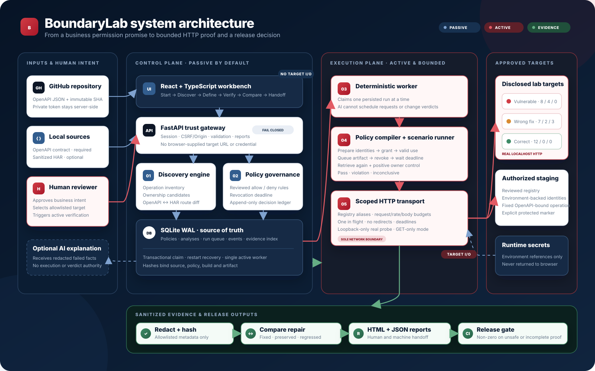
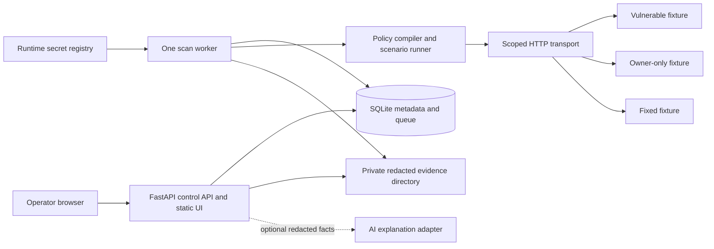
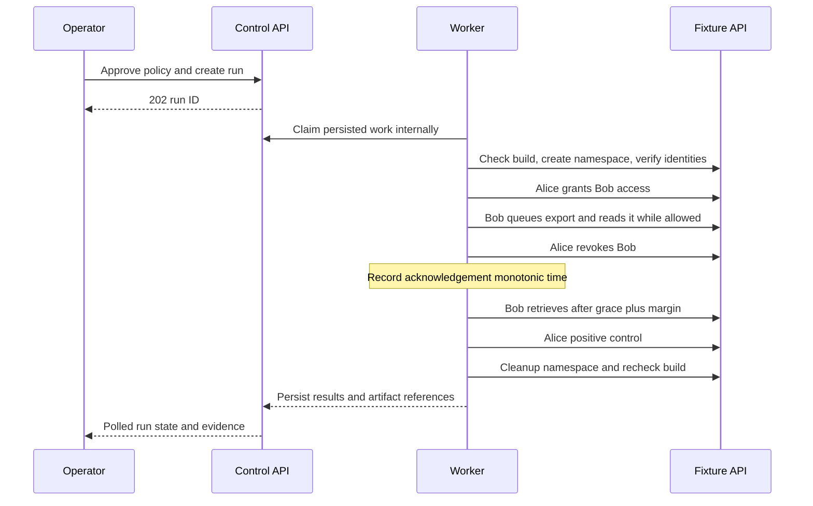

# System architecture

Local single-operator MVP. Solid boundaries below are responsibilities, not separate microservices.

UI submits intent through the API. Only the worker owns target HTTP execution. The policy compiler emits a typed plan from a supported template; the transport enforces authorization independently of what the compiler or AI suggests. Reports are served through authenticated artifact routes, never by mounting the evidence folder as static content.

The worker's database calls are shown through the API lifeline for readability; implementation uses a shared repository layer, not an exposed “worker claim” HTTP endpoint. UI polls run/events every second while active; cursor pagination avoids resending old events. SSE is unnecessary for P0.

## Trust boundaries

| Boundary | Allowed data | Enforcement |
|---|---|---|
| Browser → control API | Import, policy, selected target IDs, actions | Operator session, CSRF/origin checks, JSON schema/size validation |
| API → worker queue | Immutable IDs and hashes | Transactional claim, single active run, leases |
| Worker → target | Authorized operations on synthetic fixtures | Scoped transport, bounded rate/deadline, target registry, network rules |
| Target → stored evidence | Allowlisted metadata, redacted values and canary digests | Size cap, content type check, sanitizer before write |
| Facts → optional AI | Redacted structured facts only | No secrets, tools, arbitrary browsing or direct execution authority |

## Evolution without pretending it is already built

Pilot: customer-owned local runner and approved staging fixtures. Hosted phase: control API separated from isolated customer runners, PostgreSQL, tenant authorization, identity federation, signed job envelopes, secret broker, audit retention and incident process. This migration requires new security and failure testing; changing SQLite to PostgreSQL alone does not make it a safe multi-tenant service.

See [data model](12_DATA_MODEL.md), [security](15_SECURITY_PRIVACY.md) and [failure behavior](16_FAILURE_AND_FALLBACK_STRATEGY.md) for concrete invariants.
